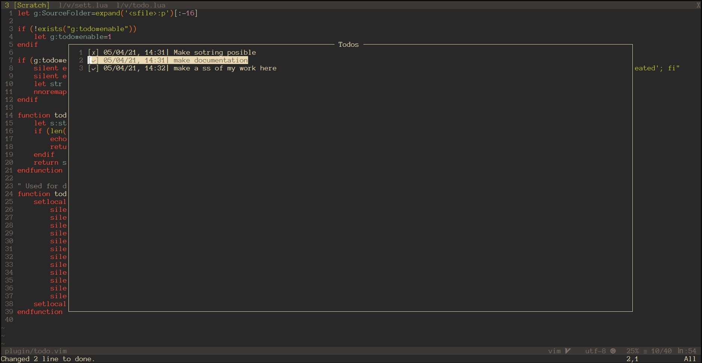

# NeoVim simple todo

## Introduction

vim-simplest-todo enables you to create and maintain global todo list. It's nothing fancy, but reliable and easy to use. 
It support adding, renaming, checking, and deleting elements.




---
## Prerequisites
- Neovim nightly
- Linux, no port to windows in in plans
- Apart from this plugin you need to install [popfix](https://github.com/RishabhRD/popfix) but as of today the `master` don't support renaming element and deleting it so please use forked version of [popfix](https://github.com/lpawlak1/popfix) with branch `list-commands`.

---
## Installation

Use your favorite plugin manager to install this plugin. [tpope/vim-pathogen](https://github.com/tpope/vim-pathogen), [VundleVim/Vundle.vim](https://github.com/VundleVim/Vundle.vim), [junegunn/vim-plug](https://github.com/junegunn/vim-plug), and [Shougo/dein.vim](https://github.com/Shougo/dein.vim) are some of the more popular ones.


Personally I use vim-plug and instructions are shown below.
<details>
<summary>Vim-Plug</summary>

1. Install Vim-Plug, according to its instructions.
2. Add the following text to your `init.vim`.
```vim
call plug#begin()
  Plug 'lpawlak1/popfix', { 'branch': 'list-commands' }
  Plug 'lpawlak1/vim-simplest-todo'
call plug#end()
```
3. Restart Vim, and run the `:PlugInstall` statement to install your plugins.
</details>

---
## Getting Started

For opening todo list use `<leader>o` in normal mode.

Enable/disable can be achieved by setting: ``g:todo#enable`` to 1 or 0 in your `init.vim`.

At the moment plugin supports only keyboard shortcuts
presented below.

Current state can offer:
- **`a`** - Adds element to the very end of the list

- **`d`** - Deletes element from under the cursor, without warning

- **`r`** - Renames element from under cursor, adds new date stample, gets input with current data from todo

- **`q`** or **`<Esc>`** - quiting and saving to global file.
    Todos are saved to file using Icon script which is precompilled. 
    If you want to quit without saving changes use **`:q<CR>`** which will not
    save changes,

- **`<CR>`** -  Changes state of todo element from checked to unchecked and from unchecked to checked. Date of the element stays as to when was the
    last rename or creation.

 **Note:** More informations on mappings and settings in `:help vim-todo`.

---
## Known bugs
- If you encounter window not opening try to tweek height and width of window.

---
## Feedback
- If you get an issue or come up with an awesome idea, don't hesitate to open an [issue](https://github.com/lpawlak1/vim-simplest-todo/issues) in github.
- If you think this plugin is useful or cool, consider rewarding it a star.
